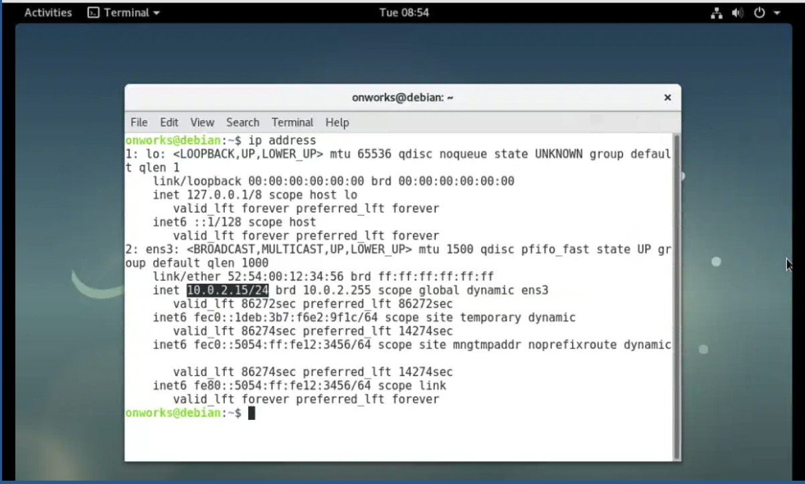
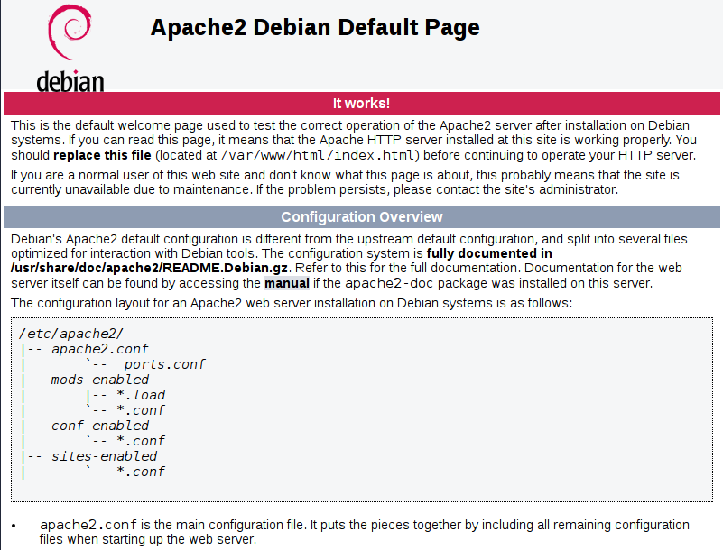

# Passos iniciais
 - (Ventoy)[https://www.ventoy.net/en/index.html] app executavél para criar um pen drive botavél
 - (Debian)[https://www.debian.org/releases/] para baixar versões ISO do debian
 - `apt update` ou `sudo apt update`

# Criando o servidor
  - Instale o apache2 `sudo apt install apache2`
  - Instale o php `apt install php-common libapache2-mod-php php-cli`, use o `sudo` no inicio se não for usuário root
  - Execute o comando `ip address` para obter o endereco de IP. O resultado deve ser parecido com esse:

    

  - Se quiser usar o `ifconfig`, instale esse pacote `sudo apt install net-tools`

# Acesso o servidor 
  - Se tudo estiver correto, vc pode acessar `127.0.0.1` ou seu IP, no meu caso `10.0.02.15` no seu navegador. O resultado deve ser parecido com esse:

    

  - Para alterar a pagina padrão do Apache, vc precisar alterar o arquivo `index.html`, no debian é a pasta `/var/www/html`. 