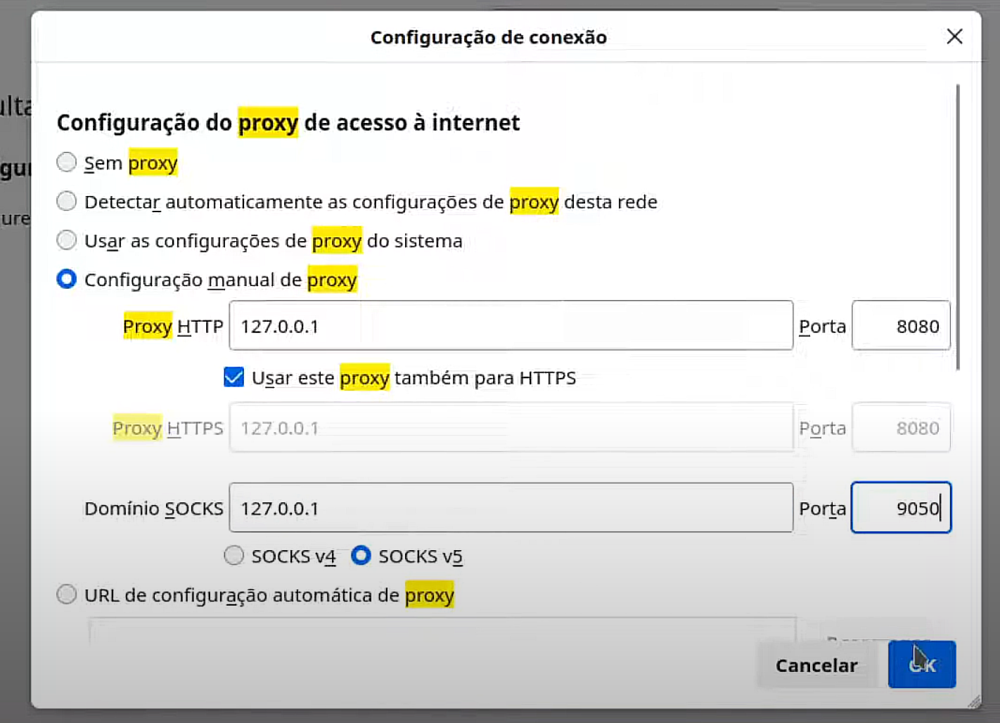

# Proxy Server 

1. Instalação do tor 
```bash
  sudo apt install tor
  sudo systemctl status tor
  sudo systemctl enable tor
```

2. Instalação do nmap
```bash
  sudo apt install nmap
  nmap -Pn localhost -p 9050
```

3. Para usar o proxy no brownser iremos usar o [http-proxy-to-socks](https://github.com/oyyd/http-proxy-to-socks).
```bash
  sudo apt install npm
  sudo npm install -g http-proxy-to-socks
  hpts -s 127.0.0.1:9050 -p 8080
``` 

4. Verificando se a porta, criada pelo [HPTS](https://github.com/oyyd/http-proxy-to-socks) está aberta usando nmap.
```bash
  nmap -Pn localhost -p 8080
``` 

5. Acesse o site [MeuIp](https://meuip.com), nele você verá o ip da sua máquina, por exemplo <code>171.120.197.232</code>. 


6. No seu navegador entre nas configurações de proxy e altere as configurações. Retorne ao [MeuIp](https://meuip.com) e note que seu IP mudará. 

