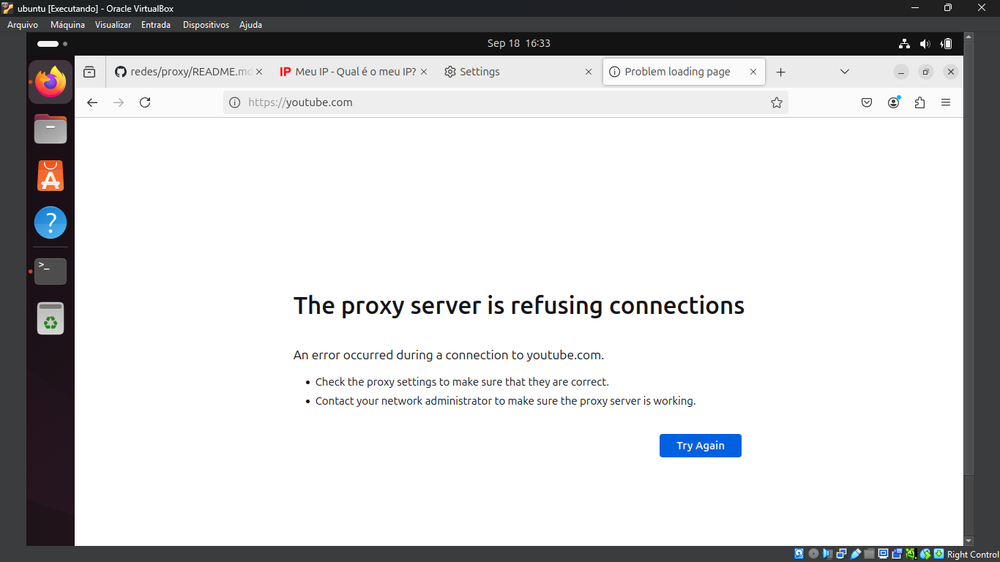

# Proxy Server 

1. Instalação do tor 
```bash
  sudo apt install tor
  sudo systemctl status tor
  sudo systemctl enable tor
```

2. Instalação do nmap
```bash
  sudo apt install nmap
  nmap -Pn localhost -p 9050
```

3. Para usar o proxy no brownser iremos usar o [http-proxy-to-socks](https://github.com/oyyd/http-proxy-to-socks).
```bash
  sudo apt install npm
  sudo npm install -g http-proxy-to-socks
  hpts -s 127.0.0.1:9050 -p 8080
``` 

4. Verificando se a porta, criada pelo [HPTS](https://github.com/oyyd/http-proxy-to-socks) está aberta usando nmap.
```bash
  nmap -Pn localhost -p 8080
``` 

5. Acesse o site [MeuIp](https://meuip.com), nele você verá o ip da sua máquina, por exemplo <code>171.120.197.232</code>. 


6. No seu navegador entre nas configurações de proxy e altere as configurações. Retorne ao [MeuIp](https://meuip.com) e note que seu IP mudará. 


# Proxy Server With Black List

1. Para adicionar uma black list, basta fazer o clone desse fork [http-proxy-to-socks-with-back-list](https://github.com/gabriel-oliveira800/http-proxy-to-socks-with-back-list).
```bash
  git clone https://github.com/gabriel-oliveira800/http-proxy-to-socks-with-back-list
  cd http-proxy-to-socks-with-back-list 
``` 

2. Faça o build do pacote localmente e crie o pacote `.tgz` 
```bash
  npm install 
  npm run build
  npm pack
``` 

3. Após executar e build e realizar o pack da projeto, terá na raiz do projeto um aquivo zip chamado `http-proxy-to-socks-with-back-list.tgz`. Instale globalmente usando o npm
```bash
  npm i -g http-proxy-to-socks-with-back-list.tgz
  hpts -s 127.0.0.1:9050 -p 8080 -b youtube.com
```

Com isso, vc receberá um error com esse, bloqueando o acesso ao [Youtube](https://youtube.com)

